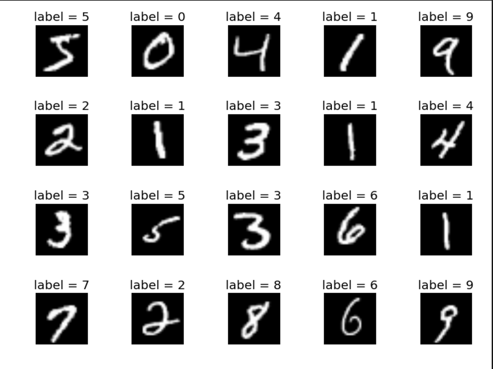

# Deep Learning on MNIST Data  Comparing Different NN Architechures ### by Mustafa Waheed
This repository contains 3 files which train and test 3 Deep Neural Networks on the famous MNIST data set.

For further reference please visit:
_https://www.tensorflow.org/get_started/mnist/pros_ 

This project uses:

*Python version 3.5*    
*Tensorflow version 1.1.0*  
 

`mnist_precip.py` file contains the code for a simple multi layered preciptron    
`mnist_rnn.py` file contains the code for a Recurrent Deep Neural Network  
`mnist_.py` file contains the code for a Convolutional Deep Neural Network 

Execute each of the python scripts to see the Model in action and compare Accuracy at the end. 

Please feel free to reachout to me with any questions or comments:
